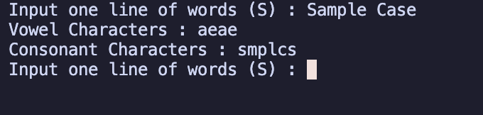
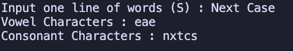
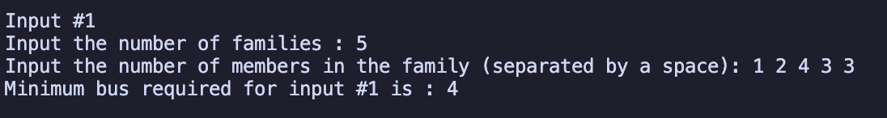
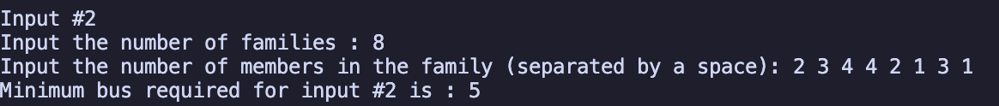
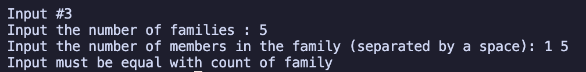

# Test-Komerce

Repository **Test-Komerce** test proyek berbasis Go.

## Cara Menjalankan

1. Pastikan sudah terpasang Go di komputer Anda.  
   Download di: https://go.dev/dl/

2. Clone repository:
   ```bash
   git clone https://github.com/ryuarnovi/Test-Komerce.git
   cd Test-Komerce
   ```

3. Jalankan file utama:
   ```bash
   go run short_char.go
   ```
# Contoh :







